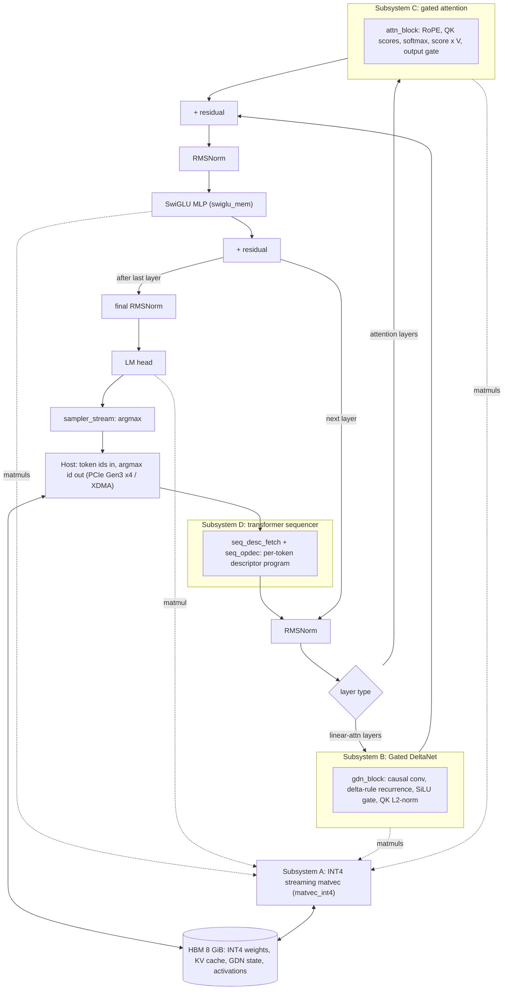

# llm.vhdl

Full-fabric VHDL LLM inference engine. Runs Qwen3.5-class transformer
inference (9B on a single card, 27B targeted across two) entirely in FPGA
fabric: INT4 streaming matvec, Gated DeltaNet, gated attention, and a
transformer sequencer, with the weights resident in on-card HBM.

Outputs are validated against [llama.cpp](https://github.com/ggml-org/llama.cpp)
running the BF16 GGUF. Its per-layer activations, captured through llama.cpp's
eval callback, are compared with a bit-accurate C model of the INT4 /
fixed-point datapath and with residuals read back from the card, and the
tokenizer and chat template are bit-exact against llama.cpp.
Details: `tools/ref9b/README.md`.

Target cards: SQRL FK33 (`xcvu33p-fsvh2104-2L-e`, 8 GiB HBM, PCIe Gen3 x4) and
Jungle Cat (2x `xcvu35p` modules, 8 GiB HBM each, Ethernet only, no PCIe).

## Architecture

Qwen3.5 is a hybrid model: most layers are a **Gated DeltaNet** linear-attention
token mixer, the rest are **gated full attention**, and every layer ends in a
SwiGLU MLP. The design splits into five subsystems (A-E); which mixer a given
layer uses is decided per token by the sequencer's descriptor program, not wired
in. Every matmul (projections, MLP, LM head) is served by the one INT4 matvec
engine (subsystem A), and all state (INT4 weights, the KV cache, the GDN
recurrent state, activations) lives in HBM.



Subsystem E (the tensor-parallel collective for multi-die inference) is still a
skeleton; at `NCARDS = 1` it is unused.

### RTL file map

The shipping Qwen3.5 path, grouped by subsystem. `rtl/` also contains
legacy stories260k / llama2-era units and `*_skel.vhd` skeletons that are
not part of this path, and several files are generated by `tools/gen_*.py`
(check line 2 before editing). Model shape lives in one place:
[`rtl/model_cfg_pkg.vhd`](rtl/model_cfg_pkg.vhd).

| Subsystem | Top | Key units |
|---|---|---|
| **A** - INT4 streaming matvec (all matmuls) | [`rtl/matvec_int4.vhd`](rtl/matvec_int4.vhd) | `matvec_core` (datapath), `weight_streamer` (INT4 weight/scale front end), `act_mem_striped` (banked activations), `matvec_int4_desc_axi` + `matvec_int4_desc_pkg` (descriptor-in-memory control), `a_desc_adapter`, `a_job_counter` |
| **B** - Gated DeltaNet (linear-attention layers) | [`rtl/gdn_block.vhd`](rtl/gdn_block.vhd) | `gdn_conv` (+`gdn_conv_w_mem`, `gdn_conv_tap_mem`) depthwise causal conv, `gdn_recur_pipe` delta-rule recurrence, `gdn_scalar` per-head scalar path, `gdn_silu` gate, `l2norm_rs` QK-norm, `gdn_state_store` (+`gdn_state_mem`/`_axi`, `gdn_exp_mem`/`_capture`) recurrent state in HBM, `gdn_job_seq`, `gdn_emit_chain`/`_head_emit`/`_y_emit` |
| **C** - gated attention (attention layers) | [`rtl/attn_block.vhd`](rtl/attn_block.vhd) | `attn_rope` RoPE, `attn_score_q12` QK scores, `attn_softmax` (+`attn_recip`), `attn_mac_array` score x V, `attn_gate` output gate, `attn_kv_axi` (+`attn_kv_quant`) KV cache in HBM, `attn_emit`, `attn_twiddle`, `rmsnorm_rs` input/QK norm |
| **D** - transformer sequencer | [`rtl/llama_top.vhd`](rtl/llama_top.vhd) | `seq_desc_fetch` (per-token program from HBM), `seq_opdec`, `seq_vec_issue`/`seq_vec_res`, `seq_region_lock` + `region_mem`/`region_drain` (activation regions), `rmsnorm_bf_mem` top-level RMSNorm, `swiglu_mem` SwiGLU MLP, `sampler_stream` argmax |
| **E** - TP collective (future, multi-die) | [`rtl/tp_collective_skel.vhd`](rtl/tp_collective_skel.vhd) | skeleton only |
| shared / HBM plumbing | - | `axi_rd_port` + `axi_rd_fsm` (HBM read masters), `async_fifo`, `stream_fifo`, `bc_port_grant` (B and C share one HBM read port) |
| FK33 integration (`hw/fk33/rtl/`) | [`fk33_card.vhd`](hw/fk33/rtl/fk33_card.vhd) | `fk33_engine` (subsystem A as a block-design cell), `fk33_llama_top` (B/C/D wrapper, generated), `fk33_seam` (host seam in front of D), `fk33_eng_cdc` (A clock-domain crossing) |

## Deploy FK33

Several steps do direct DMA and MMIO to the card: reconfiguring the FPGA tears
the PCIe bus down and rescans it, and the weight load writes into HBM. An
interrupted or faulted transaction can hang the host, so run these steps
interactively and watch them, not from cron, CI, or an unattended script. See
`docs/2026-08-27_fk33-pcie-bringup-procedure.md` for the long form.

Prerequisites: one or two FK33s in PCIe slots, Vivado 2023.2, a Linux host,
and a Qwen3.5-9B INT4 weight image with its `MANIFEST.json` (layout in
`docs/2026-08-27_hbm-residency-map.md`).

Common to both modes, build the bitstream and set up the host driver:

```bash
# Build the endpoint bitstream (~1-1.5 h; or reuse hw/fk33/bit/*.bit).
# FK33_CARD=1 adds the B/C/D subsystems; engine-only omits it.
FK33_CARD=1 hw/fk33/pcieep_build.sh

# XDMA driver (once), then group access to /dev/xdma* (once per boot).
hw/fk33/host/build_xdma_driver.sh          # compiles, installs nothing
sudo hw/fk33/host/setup-fk33-access.sh
make -C server libqwen35chat.so            # tokenizer + chat template shim
```

There are two ways to deploy.

### 1. Single card

One FK33 holds the whole 9B: every block, the LM head, the KV cache and the
GDN state in its 8 GiB of HBM.

```bash
# Program the card over JTAG (FK33_CARD=<JTAG serial> picks it).
hw/fk33/host/fk33_reload.sh hw/fk33/bit/fk33_pcieep_eng.bit

# Load the full 9B image and verify it (defaults to /dev/xdma0).
hw/fk33/host/fk33_load_weights.py load MANIFEST.json --verify

# Sanity check, gate on CTXTEST_PASS.
hw/fk33/host/fk33_ctxtest.sh single <outdir> 256

# Serve the web UI.
python3 server/llmvhdl_server.py --mode single
```

### 2. Split card (2 FK33)

The model is split as a pipeline: card 0 holds blocks `0..k-1` and ends with
the residual, card 1 holds blocks `k..N-1` plus the LM head, and the host
carries the residual between them each token. This roughly doubles decode
throughput over one card (about 2.5 tokens/s measured). Each card gets its own
image with its own block range; the split point is read off the manifests, not
configured anywhere else.

```bash
# Program both cards with the same bitstream, one at a time.
FK33_CARD=<serial A> hw/fk33/host/fk33_reload.sh hw/fk33/bit/fk33_pcieep_eng.bit
FK33_CARD=<serial B> hw/fk33/host/fk33_reload.sh hw/fk33/bit/fk33_pcieep_eng.bit

# Load each card's half of the image into its own node.
FK33_H2C=/dev/xdma0_h2c_0 FK33_C2H=/dev/xdma0_c2h_0 \
  hw/fk33/host/fk33_load_weights.py load MANIFEST.first.json --verify
FK33_H2C=/dev/xdma1_h2c_0 FK33_C2H=/dev/xdma1_c2h_0 \
  hw/fk33/host/fk33_load_weights.py load MANIFEST.second.json --verify

# Sanity check the pair, gate on CTXTEST_PASS.
hw/fk33/host/fk33_ctxtest.sh pair <outdir> 256

# Serve the web UI (pair is the default mode).
python3 server/llmvhdl_server.py
```

The `xdma0`/`xdma1` node numbers can swap on every reload, so the host assigns
each card's role from the image it holds (the card with the LM head is card 1),
not from the node number.

The cards have been tested on silicon at 75 MHz only; nothing above 75 MHz, and
nothing at the full 0.85 V VCCINT, has been run on hardware yet. Getting to
higher clocks is ongoing work. The standalone per-block ratings below (each block
placed and routed alone with `tools/rate/`, full table in `hw/targets/ratings/`)
suggest there is headroom on both parts:

| block | what it is | FK33 (`vu33p -2LV`, 0.72 V) | VU35P (`-2`, 0.85 V) |
|---|---|---|---|
| `c_attn` | attention MAC array | 150.4 | 204.5 |
| `c_kv` | KV cache over HBM | 153.8 | 228.2 |
| `v_swg` | SwiGLU | 183.5 | 242.9 |
| `a_engine` | INT4 matvec | 185.5 | 264.0 |
| `b_gdn` | Gated DeltaNet | 194.9 | 254.3 |
| `v_rms` | RMSNorm | 206.9 | 281.9 |

Either way, open `http://127.0.0.1:8000/` for the chat UI (a copy of the
llama.cpp web UI). It is greedy-only, one request at a time, with no prompt
cache; the docstring in `server/llmvhdl_server.py` explains why.

## Jungle Cat (2x VU35P): the 27B target

The two-die 27B target runs on the SQRL Jungle Cat (JCC2L-Lite carrier, two
JCM35P modules = 2x `xcvu35p`, -2L). 27B INT4 fits one VU35P at about 46% LUT,
and every shipping block closes 200 MHz on the VU35P -2 grade standalone.

**Working:** both modules program and come up with a standard `.bit` over
Ethernet through SQRL's on-board STM32, which bridges to JTAG (`sqrl_bridge`
CoE; Vivado drives it over XVC). IDCODE confirmed on both dies. No PCIe and no
bitstream reverse-engineering required.

**Blockers:**
- **No GTY reference clock.** The inter-die link (8-lane GTY / Aurora, quad 126)
  for the two-die residual hand-off and the tensor-parallel collective cannot
  come up: a sweep found no refclk on any bank, because the carrier's refclk
  oscillator sites (X1/X2) are unpopulated. The clock-injection BOM
  (a 156.25 MHz LVDS oscillator into a CDCLVD1204 fan-out) is identified and
  awaits soldering.
- **No fast weight-load path.** No PCIe; the only host paths are the CoE/JTAG
  bridge (transport-bound, ~1 MB/s class) and BMC Ethernet, far too slow for the
  ~13.5 GB of 27B INT4 weights. A JTAG-AXI probe bitstream is built to measure
  the real ceiling; a bulk path (over Aurora once the link is up, or BMC
  Ethernet) is the open question.
- **Subsystem E (the TP collective) is still a skeleton.**

See `docs/boards/jungle-cat/2026-09-27_bringup.md` and
`docs/2026-09-24_jungle-cat-performance-estimate.md`.

## Status and ongoing work

`docs/WORKLOG.md` is the live board; `docs/` holds the dated design and
debugging notes. In flight:

- **9B on silicon** -- running across two FK33s as a pipeline split (card 0
  holds the early blocks, card 1 the rest plus the LM head).
  See `docs/PLAN_TO_FIRST_INFERENCE.md` and the two-card pipeline spec.
- **27B across two dies** -- fits a VU35P at about 46% LUT; composed timing
  and the no-PCIe host path are the open items.
  See `docs/2026-09-24_jungle-cat-performance-estimate.md`.
- **Per-block fmax ratings** -- every shipping block clears 200 MHz on the
  VU35P -2 deployment grade; flow under `hw/targets/`.

## License

MIT (see [LICENSE](LICENSE)). Third-party components and their licenses are
listed in [NOTICE](NOTICE); the web UI in `ui/` is derived from the llama.cpp
web UI (MIT) and keeps its upstream notice in `ui/LICENSE.llama.cpp`.
