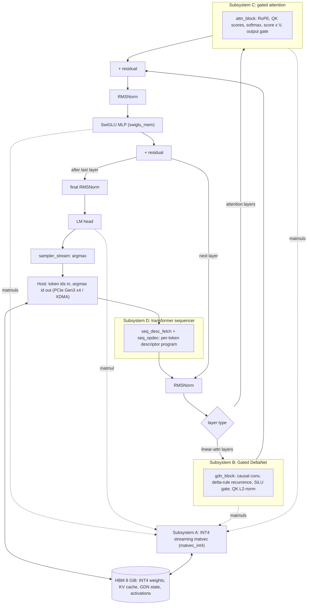

# llm.vhdl

Full-fabric VHDL LLM inference engine. Runs Qwen3.5-class transformer
inference (9B on a single card, 27B targeted across two) entirely in FPGA
fabric: INT4 streaming matvec, Gated DeltaNet, gated attention, and a
transformer sequencer, with the weights resident in on-card HBM.

Target card: SQRL FK33 (`xcvu33p-fsvh2104-2L-e`, 8 GiB HBM, PCIe Gen3 x4).

## Architecture

Qwen3.5 is a hybrid model: most layers are a **Gated DeltaNet** linear-attention
token mixer, the rest are **gated full attention**, and every layer ends in a
SwiGLU MLP. The design splits into five subsystems (A-E); which mixer a given
layer uses is decided per token by the sequencer's descriptor program, not wired
in. Every matmul (projections, MLP, LM head) is served by the one INT4 matvec
engine (subsystem A), and all state (INT4 weights, the KV cache, the GDN
recurrent state, activations) lives in HBM.



Subsystem E (the tensor-parallel collective for multi-die inference) is still a
skeleton; at `NCARDS = 1` it is unused.

### RTL file map

The shipping Qwen3.5 path, grouped by subsystem. `rtl/` also contains
legacy stories260k / llama2-era units and `*_skel.vhd` skeletons that are
not part of this path, and several files are generated by `tools/gen_*.py`
(check line 2 before editing). Model shape lives in one place:
[`rtl/model_cfg_pkg.vhd`](rtl/model_cfg_pkg.vhd).

| Subsystem | Top | Key units |
|---|---|---|
| **A** - INT4 streaming matvec (all matmuls) | [`rtl/matvec_int4.vhd`](rtl/matvec_int4.vhd) | `matvec_core` (datapath), `weight_streamer` (INT4 weight/scale front end), `act_mem_striped` (banked activations), `matvec_int4_desc_axi` + `matvec_int4_desc_pkg` (descriptor-in-memory control), `a_desc_adapter`, `a_job_counter` |
| **B** - Gated DeltaNet (linear-attention layers) | [`rtl/gdn_block.vhd`](rtl/gdn_block.vhd) | `gdn_conv` (+`gdn_conv_w_mem`, `gdn_conv_tap_mem`) depthwise causal conv, `gdn_recur_pipe` delta-rule recurrence, `gdn_scalar` per-head scalar path, `gdn_silu` gate, `l2norm_rs` QK-norm, `gdn_state_store` (+`gdn_state_mem`/`_axi`, `gdn_exp_mem`/`_capture`) recurrent state in HBM, `gdn_job_seq`, `gdn_emit_chain`/`_head_emit`/`_y_emit` |
| **C** - gated attention (attention layers) | [`rtl/attn_block.vhd`](rtl/attn_block.vhd) | `attn_rope` RoPE, `attn_score_q12` QK scores, `attn_softmax` (+`attn_recip`), `attn_mac_array` score x V, `attn_gate` output gate, `attn_kv_axi` (+`attn_kv_quant`) KV cache in HBM, `attn_emit`, `attn_twiddle`, `rmsnorm_rs` input/QK norm |
| **D** - transformer sequencer | [`rtl/llama_top.vhd`](rtl/llama_top.vhd) | `seq_desc_fetch` (per-token program from HBM), `seq_opdec`, `seq_vec_issue`/`seq_vec_res`, `seq_region_lock` + `region_mem`/`region_drain` (activation regions), `rmsnorm_bf_mem` top-level RMSNorm, `swiglu_mem` SwiGLU MLP, `sampler_stream` argmax |
| **E** - TP collective (future, multi-die) | [`rtl/tp_collective_skel.vhd`](rtl/tp_collective_skel.vhd) | skeleton only |
| shared / HBM plumbing | - | `axi_rd_port` + `axi_rd_fsm` (HBM read masters), `async_fifo`, `stream_fifo`, `bc_port_grant` (B and C share one HBM read port) |
| FK33 integration (`hw/fk33/rtl/`) | [`fk33_card.vhd`](hw/fk33/rtl/fk33_card.vhd) | `fk33_engine` (subsystem A as a block-design cell), `fk33_llama_top` (B/C/D wrapper, generated), `fk33_seam` (host seam in front of D), `fk33_eng_cdc` (A clock-domain crossing) |

## Deploy to an FK33, end to end

This runs the validated silicon path. Several steps do direct DMA and MMIO
to the card: reconfiguring the FPGA tears the PCIe bus down and rescans it, and
the weight load writes 8 GiB into HBM. An interrupted or faulted transaction can
hang the host, so run these steps interactively and watch them, not from cron,
CI, or an unattended script. See `docs/2026-08-27_fk33-pcie-bringup-procedure.md`
for the long form.

Prerequisites: an FK33 in a PCIe slot, Vivado 2023.2, a Linux host, and the
Qwen3.5-9B weight image with its `MANIFEST.json` (layout in
`docs/2026-08-27_hbm-residency-map.md`).

```bash
# 1. Build the endpoint bitstream (~1-1.5 h; or reuse hw/fk33/bit/*.bit).
#    FK33_CARD=1 adds the B/C/D subsystems; engine-only omits it.
FK33_CARD=1 hw/fk33/pcieep_build.sh

# 2. Host-side XDMA driver (once), then grant group access (once per boot).
hw/fk33/host/build_xdma_driver.sh          # compiles, installs nothing
sudo hw/fk33/host/setup-fk33-access.sh     # loads xdma, 0660 group access

# 3. Program the card over JTAG (bus is taken down and rescanned around it).
hw/fk33/host/fk33_reload.sh hw/fk33/bit/fk33_pcieep_eng.bit

# 4. Place the 9B weight image into HBM and verify it landed.
hw/fk33/host/fk33_load_weights.py load MANIFEST.json --verify

# 5. Sanity check: a short two-card context test (gate on CTXTEST_PASS).
hw/fk33/host/fk33_ctxtest.sh pair /mnt/storage/fk33_builds/ctxtest 256

# 6. Serve the web UI and chat. Build the tokenizer/template shim, then run
#    the server (two cards by default; --mode single for one).
make -C server libqwen35chat.so
python3 server/llmvhdl_server.py           # --mode single for one card
```

Then open `http://127.0.0.1:8000/` for the chat UI (a copy of the llama.cpp
web UI). It is greedy-only, one request at a time, no prompt cache; the server
docstring in `server/llmvhdl_server.py` explains why. Current measured decode
is about 2.5 tokens/s on the two-card pipeline.

## Status and ongoing work

`docs/WORKLOG.md` is the live board; `docs/` holds the dated design and
debugging notes. In flight:

- **9B on silicon** -- running across two FK33s as a pipeline split (card 0
  holds the early blocks, card 1 the rest plus the LM head).
  See `docs/PLAN_TO_FIRST_INFERENCE.md` and the two-card pipeline spec.
- **27B across two dies** -- fits a VU35P at about 46% LUT; composed timing
  and the no-PCIe host path are the open items.
  See `docs/2026-09-24_jungle-cat-performance-estimate.md`.
- **Jungle Cat carrier (2x VU35P) and the inter-card link** -- Aurora over
  spare GTY lanes, plus the tensor-parallel collective (subsystem E), are in
  design. See `docs/boards/jungle-cat/` and `docs/fpga-hardware-recon.md`.
- **Per-block fmax ratings** -- every shipping block clears 200 MHz on the
  VU35P -2 deployment grade; flow under `hw/targets/`.

## License

MIT (see [LICENSE](LICENSE)). Third-party components and their licenses are
listed in [NOTICE](NOTICE); the web UI in `ui/` is derived from the llama.cpp
web UI (MIT) and keeps its upstream notice in `ui/LICENSE.llama.cpp`.
